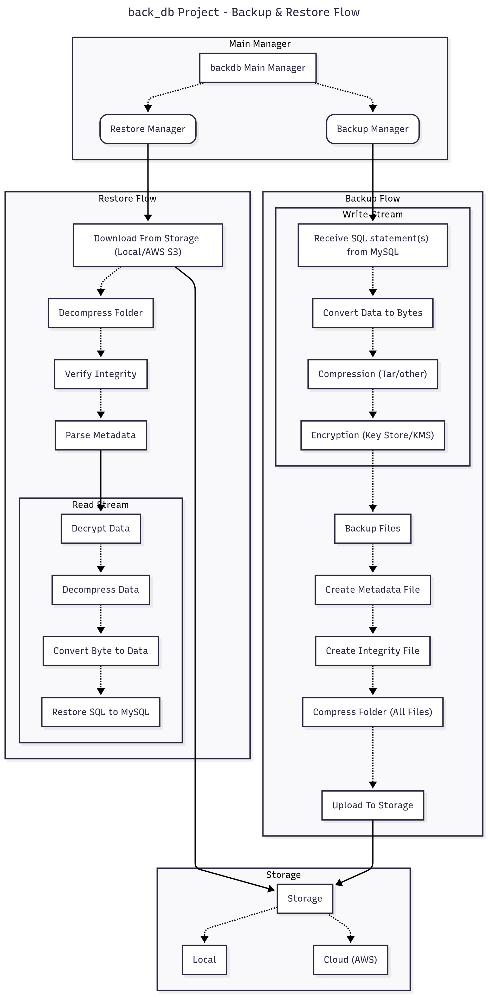
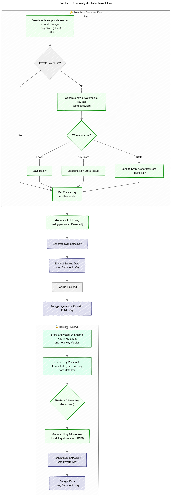

# BackyDB

A modular backup and restore system designed to provide flexible, secure, and efficient database backups with support for MySQL and extensible architecture.

## Table of Contents

- [Features](#features)
- [Architecture](#architecture)
  - [System Architecture Flow](#system-architecture-flow)
  - [Security Architecture Flow](#security-architecture-flow)
- [Installation](#installation)
- [Requirements](#requirements)
- [Usage](#usage)
  - [Backup Features](#backup-features)
  - [Minimum Required Backup Configuration Example](#minimum-required-backup-configuration-example)
  - [Full Backup Configuration Example](#full-backup-configuration-example)
  - [Restore Configuration Example](#restore-configuration-example)
  - [Environment Variables](#environment-variables)
  - [Basic Example](#basic-example)
  - [Configuration Options](#configuration-options)
- [Tests](#tests)
  - [Running Tests](#running-tests)
- [Development Helpers](#development-helpers)
- [Future Features](#future-features)
- [Contributing](#contributing)
- [License](#license)


## Features

- Modular architecture with components for compression, encryption, integrity, storage, and more  
- Supports MySQL database backup and restore with SQL export or compressed/encrypted formats  
- Flexible configuration via YAML or JSON  
- Integration with security tools including local and Google Cloud keystore, and AWS KMS support  
- Supports multiple backup modes: raw SQL, compressed only, encrypted only, or full backup (compressed + encrypted)  
- Multiple compression options: ZIP, TAR  
- Hybrid encryption with AES-GCM and RSA-4096  
- Metadata generation for backup integrity and management  
- Validator module for HMAC and checksum verification  
- Supports local storage and AWS S3  
- Designed for extensibility with cloud provider support planned  

## Architecture

BackyDB consists of two main architecture flows illustrating its modular design and security processes:

### System Architecture Flow



The system flow highlights how BackyDB orchestrates configuration, schema selection, IO operations, validation, compression, encryption, storage, and metadata management. Each module interacts seamlessly to handle backup and restore workflows efficiently.

### Security Architecture Flow



The security flow focuses on key management and encryption processes. It details key retrieval or generation, hybrid encryption using AES-GCM and RSA-4096, integration with local and GCP keystores, cloud KMS providers AWS, and secure restoration through decryption and integrity checks.

Both flows emphasize extensibility and secure handling of backup data across multiple storage backends and cloud environments.

## Installation

You can install **backy_db** using pip:

```bash
pip install backy-db
```

To include optional dependencies, use:

- For AWS support:

    ```bash
    pip install backy-db[aws]
    ```

- For Google Cloud Platform support:

    ```bash
    pip install backy-db[gcp]
    ```

- For full installation with all optional dependencies:

    ```bash
    pip install backy-db[full]
    ```

## Requirements

- Python 3.8 or higher
- MySQL server (if using MySQL backup features)

## Usage

BackyDB supports flexible backup and restore workflows with customizable options for compression, encryption, integrity checks, storage, and backup feature selection.

### Backup Features

- **Backup format:**
  - If **no compression** and **no encryption** are enabled, the backup will be a plain SQL dump file (`.sql`).
  - If **compression**, **encryption**, or both are enabled, the backup file will have a `.backy` extension.
- **Metadata generation** and optional **integrity check** are created after the 
backup.
- **Backup modes**:
  - **Raw SQL**: Direct SQL dump without compression or encryption.
  - **Compressed only**: Backup is compressed but not encrypted.
  - **Encrypted only**: Backup is encrypted but not compressed.
  - **Full backup**: Backup is both compressed and encrypted.
- Backups should be compressed and uploaded to cloud storage or saved locally.
- Backup can be split into separate files per feature (tables, data, views, functions, procedures, triggers, events) or saved as a single file.
- The default backup includes **tables** and **data** only.

### Minimum Required Backup Configuration Example

```json
{
  "database": {
    "host": "localhost",
    "user": "root",
    "port": 3306,
    "db_name": "backy_db"
  },
  "storage": {
    "storage_type": "local"
  }
}
```

### Full Backup Configuration Example

```json
{
  "database": {
    "host": "localhost",
    "user": "root",
    "port": 3306,
    "db_name": "backy_db",
    "multiple_files": true,
    "features": {
      "tables": true,
      "data": true,
      "views": true,
      "functions": true,
      "procedures": false,
      "triggers": false,
      "events": true
    }
  },
  "compression": {
    "compression": true,
    "compression_type": "tar"
  },
  "security": {
    "encryption": true,
    "type": "keystore",
    "provider": "local",
    "key_size": 4096
  },
  "integrity": {
    "integrity_check": true,
    "integrity_type": "hmac"
  },
  "storage": {
    "storage_type": "local"
  }
}
```

### Restore Configuration Example

```json
{
  "database": {
    "host": "localhost",
    "user": "root",
    "port": 3307,
    "db_name": "backy_db"
  },
  "backup_path": "/path/to/backup/file.backy",
  "storage": {
    "storage_type": "local"
  }
}
```

### Environment Variables

BackyDB supports optional and required environment variables depending on the selected configuration.

- Required Variables (always required)

    ```bash
    DB_PASSWORD=root
    LOGGING_PATH=/path/to/logs
    ```

- Conditional Variables

    - If encryption is enabled:

        ```bash
        PRIVATE_KEY_PASSWORD=private_key_password
        ```

    - If using Local Key Store encryption:

        ```bash
        LOCAL_KEY_STORE_PATH=/path/to/keys
        ```

    - Google Key Store encryption:

        ```bash
        GOOGLE_APPLICATION_CREDENTIALS=/path/to/gcp/credentials.json
        GCP_PROJECT_ID=my-gcp-project
        ```

    - If using AWS KMS encryption:

        ```bash
        AWS_ACCESS_KEY_ID=your-access-key
        AWS_SECRET_ACCESS_KEY=your-secret-key
        AWS_REGION=your-region
        ```

    - If using Integrity with HMAC type:

        ```bash
        INTEGRITY_PASSWORD=integrity_password
        ```

    - If using Local storage:

        ```bash
        LOCAL_PATH=/path/to/local/storage
        ```

    - If using AWS S3 storage:

        ```bash
        AWS_S3_ACCESS_KEY_ID=your-access-key
        AWS_S3_SECRET_ACCESS_KEY=your-secret-key
        AWS_S3_BUCKET_NAME=your-bucket-name
        AWS_S3_REGION=your-region
        ```

### Notes

- You can customize which database features to backup or restore by enabling/disabling options under **features**.

- Storage options currently support **local** and cloud provider **AWS**.

- Compression supports types like **tar** or **zip**.

- Security supports hybrid encryption with local or cloud support **key_store** (local or GCP) and **KMS** (AWS).

- Integrity supports **HMAC** or **checksum** validation.

- You can use **YAML** or **JSON** for configuration files.

### Basic Example

```python
from backy_db import BackyDB

# Initialize the BackyDB instance
backy_db = BackyDB()

# Define your backup configuration as a dictionary
backup_config = {
    "database": {
        "host": "localhost",
        "user": "root",
        "port": 3306,
        "db_name": "backy_db",
        # Additional optional fields like 'multiple_files' and 'features' can be added
    },
    "storage": {
        "storage_type": "local",
    }
}

# Perform a backup
backy_db.backup(backup_config)

# Define your restore configuration as a dictionary
restore_config = {
    "database": {
        "host": "localhost",
        "user": "root",
        "port": 3307,
        "db_name": "backy_db",
    },
    "backup_path": "/path/to/backup/file.backy",
    "storage": {
        "storage_type": "local",
    }
}

# Perform a restore
backy_db.restore(restore_config)
```

### Configuration Options

- Backup supports:

    - Backing up data as raw SQL files (when no compression or encryption is specified).

   - Compressed and/or encrypted backups with a .backy extension.

    - Selecting features to backup such as tables, data, views, functions, procedures, triggers, and events.

    - Splitting backup into multiple files (per feature) or a single file.

- Restore expects:

    - The database connection information.

    - The path to the backup file.

    - Storage details.

Refer to the Configuration section for full schema details.

## Tests

BackyDB includes a comprehensive test suite to ensure code quality and reliability. You can run tests, coverage reports, linting, and formatting using the provided `Makefile` commands.

### Running Tests

- Run all tests:

  ```bash
  make test
  ```

- Run tests with automatic start and stop of required databases via Docker:

  ```bash
  make full-test
  ```

- Run tests with coverage report:

  ```bash
  make cov
    ```

- Run tests with coverage and automatic database management:

    ```bash
    make full-test-cov
    ```

## Development Helpers

- Install development dependencies (including testing tools):

    ```bash
    make install-dev
    ```

- Run lint checks with ruff:

    ```bash
    make lint
    ```

- Format code using black:

    ```bash
    make format
    ```

- Clean up temporary files and caches:

    ```bash
    make clean
    ```

- Start the required databases (defined in tests/docker-compose.yml):

    ```bash
    make start-databases
    ```

- Stop the databases and clean up volumes:

    ```bash
    make stop-databases
    ```

If you want, I can help add instructions for Docker or environment setup related to tests next.

## Future Features

- Support for additional database engines (PostgreSQL and MongoDB)
- Support for additional cloud storage options (GCP, Azure, Oracle)
- Support for additional compression algorithms
- Support for additional key store and KMS providers
- Command-line interface (CLI) support
- Real-time backup monitoring dashboard
- Direct secure database migration
- Incremental backups with version control
- Conflict resolution options for restore
- Security key rotation
- Schema conversion between different database engines
- Backup and restore history logging
- Scheduled backups via CRON jobs

## Contributing

Contributions to BackyDB are welcome! Whether it's bug reports, feature requests, or code improvements, please follow these guidelines to help us maintain a high-quality project:

- Fork the repository and create your branch from `main`.
- Write clear, concise commit messages.
- Ensure your code follows the existing style and conventions.
- Write tests for new features or bug fixes.
- Run all tests and ensure they pass before submitting a pull request.
- Open a pull request describing your changes and why they are needed.

For any questions or discussions, feel free to open an issue or join the community discussions.

## License

BackyDB is licensed under the MIT License.

Idea of the project from: https://roadmap.sh/projects/database-backup-utility
